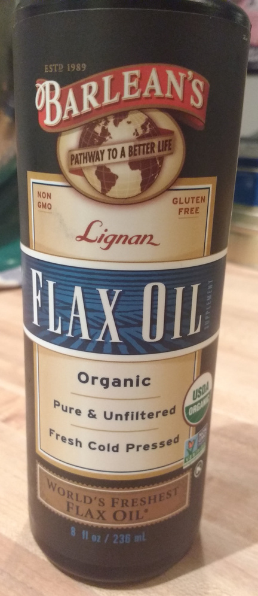
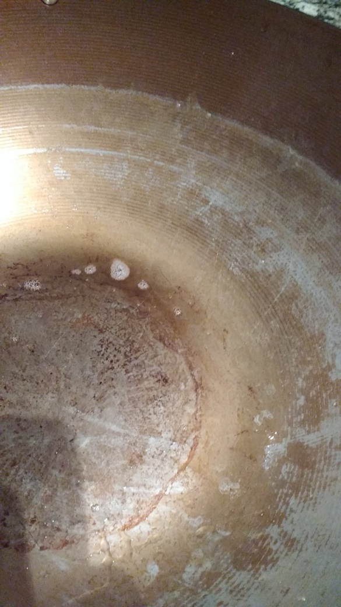
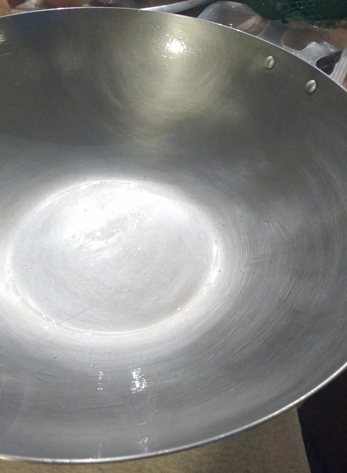
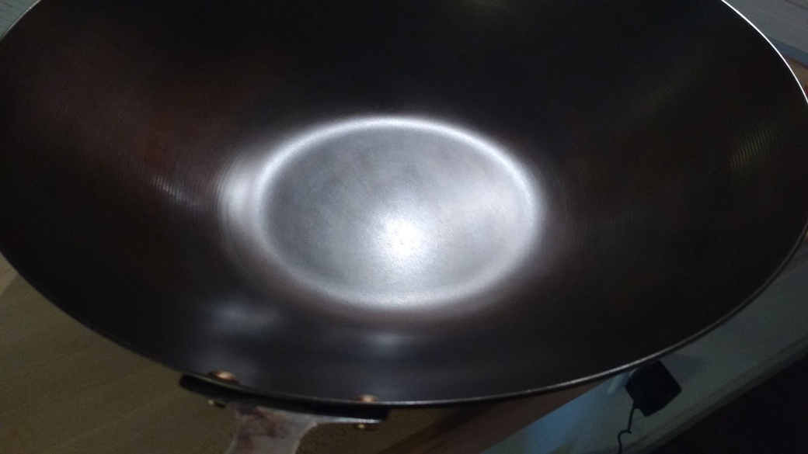

# Seasoning a carbon steel or cast iron pan

This was done on a carbon steel wok.

## Equipment

- carbon steel wok (or other carbon steel/cast iron pan)
- heavy duty scour pad
- soap
- paper towels
- oven
- oven cleaner to clean the pan (old/failed seasoning, gunk, etc)
- flaxseed oil

## Preparation steps

1. **Remove pan handles (optional):**
Most woks will let you unscrew the handles.

1. **Clean the pan:** Use a scrubber to clean the pan down to the bare
metal. Some people recommend stripping the pan by running it through
the oven self-cleaning cycle. To clean up my failed seasoning, I
sprayed oven cleaner on the wok (outside, wearing gloves, mask, long
sleeves), let it sit overnight, wiped down the wok and then scrubbed
hard. I had to repeat this several times.

Initial, dirty wok (failed seasoning with vegetable oil):

Cleaned wok:

## Seasoning steps

1. **Warm the pan in a 200F oven:**
This will open up the pan's pores and make sure it is completely dry.

1. **Rub 1 tsp flaxseed oil all over the pan:**
Shake the oil bottle to mix it. Rub the oil into the pan with your
hands and make sure everything is thoroughly oiled.

1. **Thoroughly wipe pan with fresh towels to remove the oil:**
Use paper towels or cotton cloth. Do this until you think you have
wiped everything off. There will be a microscopic layer of oil left on
the pan. The pan should look completely dry. This is an important
step!

1. **Put pan upside-down in cold oven**

1. **Bake for 1h in 500F oven:**
Turn on the oven.  When the oven
reaches 500F, set the timer for 1 hour. Make sure the area is well
ventilated. Turn off the oven after 1h but do not open the oven door.

1. **Let cool in oven for 2h:**
Leave the pan in the oven to cool down for 2h. If you remove it too
early, the seasoning will crack.

1. **Repeat the process (steps 1-6) until you have 6 coats of seasoning:** The pan will develop a bit of a sheen towards the end.

## Results

The wok got darker and clearly some seasoning happened. I missed a
spot when rubbing off the oil during the first layer and that left a
darker stain at the bottom. After cooking with it once, I am worried
that some of the seasoning came off. If that is the case, I believe it
has to do with the fact that I did not create the "black rust" as is
suggested
[here](http://sherylcanter.com/wordpress/2010/02/black-rust-and-cast-iron-seasoning/)
and in other seasoning videos. This might not be an issue for cast
iron pans, but more of a problem for woks? If I need to do this again,
I would repeat the steps but before doing the first layer, heat up the
wok on an open flame (oustide) or in a 450F oven until the pan changes
color.

## Tips
- Use flax seed oil, don't waste your time with anything else.
- Use a _thin_ layer of oil. Do not try to accelerate the process by
  using thicker layers (risk of uneven surfaces, sticky residue,
  flaking)
- Do not take it out of the oven too early. Make sure it cools down
  completely.
- This will not give you a completely non stick surface on the first
  go. This is just a preliminary seasoning. To get a slicker surface,
  one person recommends cooking up some whisked eggs with a bit of
  oil, moving it around the pan with a steel spatula (they will stick
  a bit), taking them out, scouring the pan with kosher salt and oil,
  and then rinsing it in hot water.

## References

- [Sheryl Canter's science explanation](http://sherylcanter.com/wordpress/2010/01/a-science-based-technique-for-seasoning-cast-iron/)
- [Cook's illustrated tried the method and recommended it](https://www.cooksillustrated.com/how_tos/5820-the-ultimate-way-to-season-cast-iron)
- [Very detailed instructions of Canter method](https://www.thekitchn.com/i-seasoned-my-cast-iron-pan-with-flaxseed-oil-and-heres-what-happened-224612)
- [Youtube video](https://youtu.be/OXp6KRw_Qzo)
